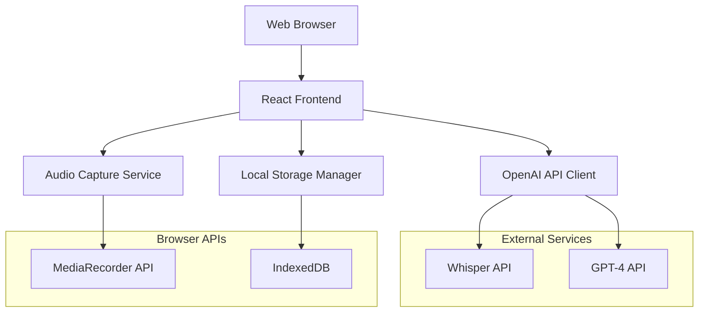

# Design Document

## Overview

The Shopkeeper UPI Tracker is a web-based MVP application designed for Indian small business owners to seamlessly track UPI transactions, manage inventory, and gain business insights through AI-powered features. The application leverages Google's Gemini API for audio transcription, intelligent product suggestions, and conversational insights.

The core innovation lies in automatically capturing UPI soundbox alerts through device microphone, transcribing them using Gemini, and intelligently mapping transaction amounts to products using Gemini's reasoning capabilities, creating a frictionless sales logging experience.

## Architecture

### High-Level Architecture



### Technology Stack

- **Frontend Framework**: React with TypeScript for type safety and component reusability
- **State Management**: React Context API with useReducer for predictable state updates
- **Data Persistence**: IndexedDB via Dexie.js for robust local storage with structured queries
- **Audio Processing**: Web Audio API and MediaRecorder for real-time audio capture
- **AI Integration**: Google AI JavaScript SDK for Gemini API calls
- **UI Framework**: Tailwind CSS with custom components optimized for touch interfaces
- **Build Tool**: Vite for fast development and optimized production builds

## Components and Interfaces

### Core Components

#### 1. Audio Capture Service
```typescript
interface AudioCaptureService {
  startListening(): Promise<void>;
  stopListening(): void;
  onAudioDetected: (audioBlob: Blob) => void;
  isListening: boolean;
}
```

**Responsibilities:**
- Continuous microphone monitoring with voice activity detection
- Audio blob creation when UPI alerts are detected
- Noise filtering to reduce false positives
- Battery-optimized recording cycles

#### 2. Transaction Processor
```typescript
interface TransactionProcessor {
  processAudio(audioBlob: Blob): Promise<TransactionResult>;
  extractAmount(transcription: string): number | null;
  suggestProducts(amount: number, history: Transaction[]): Product[];
}

interface TransactionResult {
  amount: number;
  confidence: number;
  suggestedProducts: Product[];
  transcription: string;
}
```

**Responsibilities:**
- Gemini API integration for audio transcription
- Amount extraction using regex patterns for Indian currency formats
- Gemini-powered product suggestion based on amount and transaction history
- Confidence scoring for transcription accuracy

#### 3. Inventory Manager
```typescript
interface InventoryManager {
  updateStock(productId: string, quantity: number): void;
  checkLowStock(): Product[];
  adjustStock(productId: string, adjustment: number, reason: string): void;
  getStockLevel(productId: string): number;
}
```

**Responsibilities:**
- Real-time stock level updates
- Low stock threshold monitoring
- Manual adjustment tracking with audit trail
- Expiry date management for perishable items

#### 4. Chat Assistant
```typescript
interface ChatAssistant {
  processQuery(query: string, context: BusinessContext): Promise<string>;
  getSalesInsights(): Promise<InsightSummary>;
  getInventoryStatus(): Promise<InventoryStatus>;
}

interface BusinessContext {
  todaysSales: Transaction[];
  inventory: Product[];
  salesHistory: Transaction[];
}
```

**Responsibilities:**
- Gemini integration with business context injection
- Multilingual query processing (English, Hindi, Kannada)
- Sales analytics and trend identification
- Natural language response generation

### Data Models

#### Product Model
```typescript
interface Product {
  id: string;
  name: string;
  price: number;
  stock: number;
  reorderThreshold: number;
  imageUrl?: string;
  expiryDate?: Date;
  category: string;
  createdAt: Date;
  updatedAt: Date;
}
```

#### Transaction Model
```typescript
interface Transaction {
  id: string;
  amount: number;
  products: TransactionItem[];
  type: 'upi' | 'cash';
  timestamp: Date;
  transcription?: string;
  confidence?: number;
}

interface TransactionItem {
  productId: string;
  quantity: number;
  unitPrice: number;
}
```

#### Shop Model
```typescript
interface Shop {
  id: string;
  name: string;
  type: string;
  ownerId: string;
  createdAt: Date;
  settings: ShopSettings;
}

interface ShopSettings {
  currency: 'INR';
  language: 'en' | 'hi' | 'kn';
  lowStockThreshold: number;
  autoSuggestEnabled: boolean;
}
```

## Error Handling

### Audio Processing Errors
- **Microphone Access Denied**: Graceful fallback to manual transaction entry with clear user guidance
- **Network Connectivity Issues**: Queue audio files locally and process when connection is restored
- **Gemini API Failures**: Retry mechanism with exponential backoff, fallback to manual amount entry
- **Low Audio Quality**: Confidence scoring with user confirmation for low-confidence transcriptions

### Data Persistence Errors
- **IndexedDB Quota Exceeded**: Automatic cleanup of old transactions with user notification
- **Storage Corruption**: Data validation and recovery mechanisms with backup export options
- **Concurrent Access**: Optimistic locking for inventory updates to prevent race conditions

### API Integration Errors
- **Gemini Rate Limits**: Request queuing with user feedback and graceful degradation
- **Authentication Failures**: Clear error messages with API key validation guidance
- **Timeout Handling**: Progressive timeout increases with user notification

## Testing Strategy

### Unit Testing
- **Audio Service**: Mock MediaRecorder API, test voice activity detection algorithms
- **Transaction Processing**: Test amount extraction regex patterns with various UPI alert formats
- **Inventory Management**: Validate stock calculations and low stock threshold logic
- **Data Models**: Test validation rules and business logic constraints

### Integration Testing
- **Gemini API Integration**: Test with sample audio files and various transaction scenarios
- **Local Storage**: Validate data persistence across browser sessions and storage limits
- **Cross-Component Communication**: Test state synchronization between components

### User Acceptance Testing
- **Onboarding Flow**: Test with non-technical users to validate UX simplicity
- **Audio Capture**: Test with actual UPI soundbox alerts in noisy environments
- **Multilingual Support**: Validate chat responses in Hindi and Kannada
- **Performance**: Test on 8GB RAM laptops with concurrent audio processing

### Demo Preparation
- **Scripted Scenarios**: Pre-recorded UPI alerts for consistent demo experience
- **Sample Data**: Realistic product catalog and transaction history for meaningful insights
- **Error Scenarios**: Demonstrate graceful error handling and recovery
- **Performance Metrics**: Showcase response times and accuracy statistics

### Accessibility and Localization
- **Visual Design**: High contrast colors, large touch targets for mobile-first experience
- **Language Support**: Unicode support for Devanagari and Kannada scripts
- **Voice Interface**: Clear audio feedback for successful transaction captures
- **Offline Capability**: Core functionality available without internet connectivity

### Security Considerations
- **API Key Management**: Secure client-side storage with environment variable configuration
- **Data Privacy**: Local-only storage with no external data transmission except to Google Gemini
- **Audio Data**: Automatic deletion of audio files after successful transcription
- **Input Validation**: Sanitization of all user inputs to prevent injection attacks